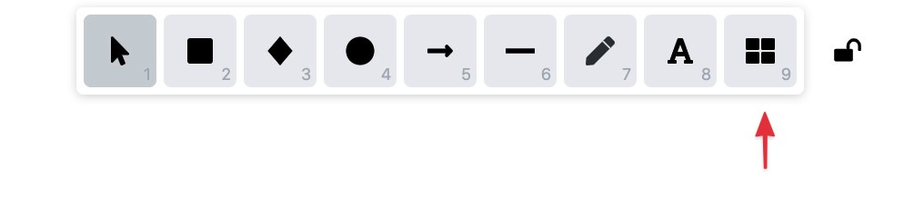
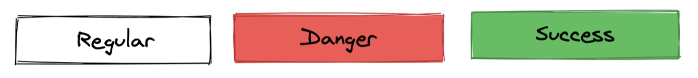
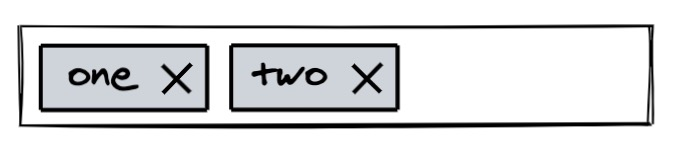
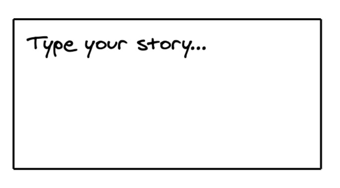
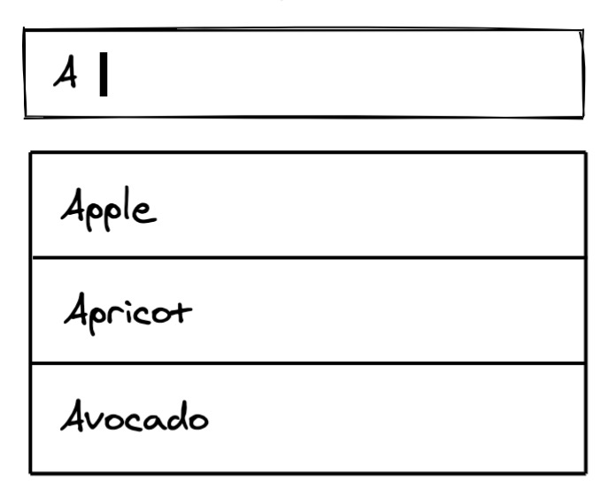
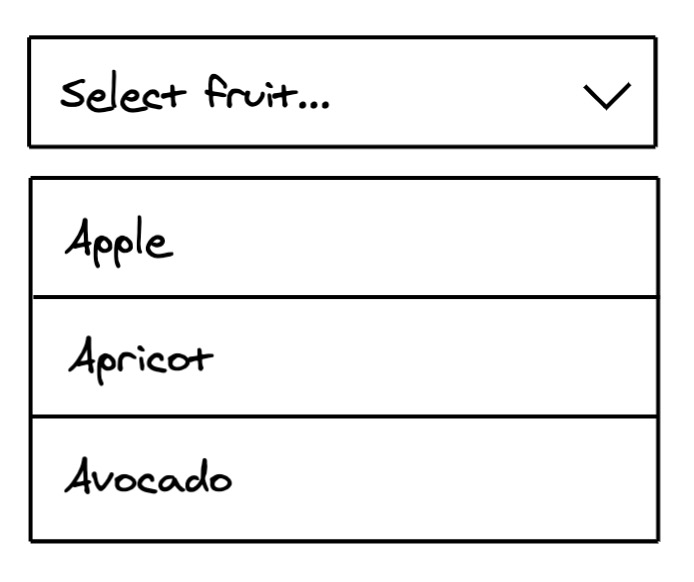
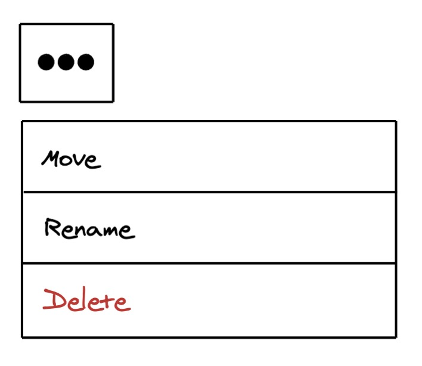
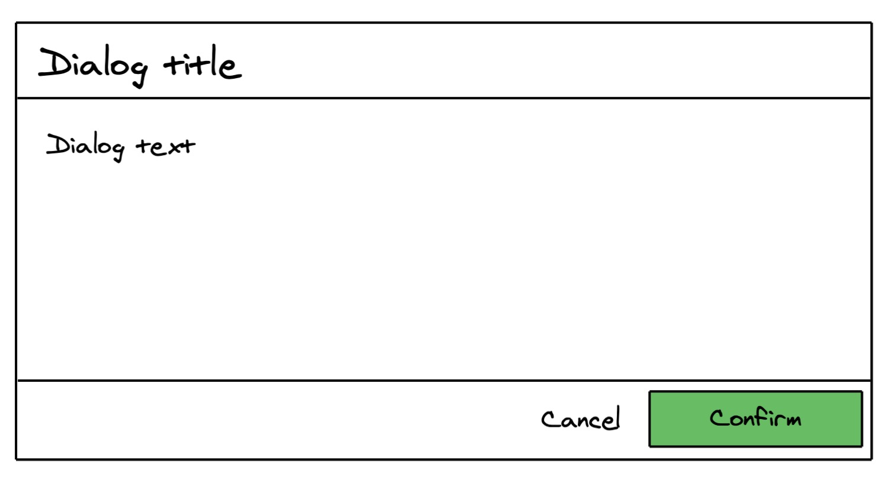
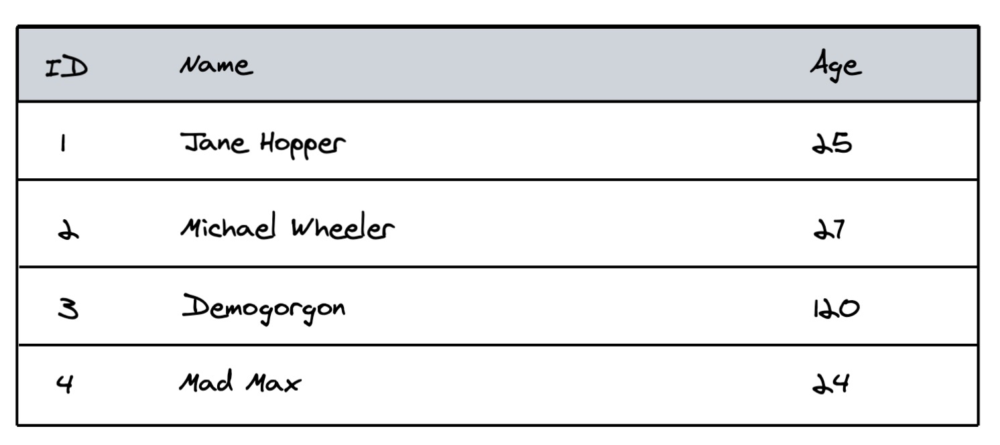

# excalidraw-ui

> Collection of reusable UI elements for [Excalidraw](https://excalidraw.com/).

## Usage

- Download [excalidraw-ui](ui.excalidrawlib).
- Open [Excalidraw](https://excalidraw.com).
- Open library (or press "9").

- Click on any element within the library and it will be added to your document.

## Overview

### Buttons

### Avatars

### Text Input

### Search Input

### Tag Input

### Textarea

### Autocomplete

### Select Input

### "More" Menu

### Checkbox

### Radio

### Dialog

### Table

